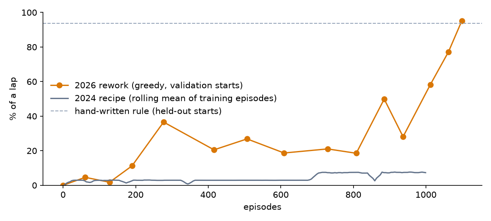

# Car Racing AI — from a Q-table to deep Q-learning

A top-down racing game on a trace of the Bahrain circuit, and an agent that learns to drive it.
**Watch it, or race its ghost, in your browser:** https://portfolio-ahl.pages.dev/college/game-ais (the Car tab)

## The short version
In 2024 I built this with tabular Q-learning. It never learned to drive: re-running its state, reward and hyperparameters on
the rebuilt game (one run of each, table below; rays marched in 4px steps, and a crash now ends the run), it covers well under 1% of a lap from starting points it
never trained from. In 2026 I rebuilt the game headless, replaced the table with a small network, and
measured progress properly.

Dots are validation scores (the last was picked on them); the dashed line is the rule on held-out starts — see Results for the like-for-like comparison.

## Results
| | % of a lap (held-out starts) | Laps finished | Laps from the start line |
|---|---|---|---|
| 2024 recipe (re-run) | 0.40 | 0/32 | no (7.6%) |
| Hand-written rule | 93.8 | 30/32 | 17.55 s |
| 2026 rework | 90.6 | 29/32 | 18.05 s |

On held-out starts the hand-written rule is slightly ahead of the rework (93.8% vs 90.6%, 30 vs 29 laps, 17.55 s vs 18.05 s from the start line).

Measured greedily from 32 held-out starting points round the lap (and from the start line). Checkpoints
were selected on a separate 32. The hand-written rule steers toward the more open 45° sensor and sets its
target speed to the gap ahead ÷ 20.

## Why the 2024 version never learned
These are the problems I found reading the code back; I didn't ablate them one at a time.
- **The state couldn't see the road.** Heading plus 8 world-frame distances, each binned into five 240px
  bins — so nearly every position looked the same. In 1000 episodes it visited only a handful of the
  table's millions of states (the `states_seen` that `baseline_2024.py` writes).
- **The reward paid for odometry,** not progress round the track, so circling counted.
- **Walls weren't walls:** a collision only halved the speed, and the car could scrape along the border.
- **The car moved twice per frame unless it was steering** (`take_action` called `move()` after `move_forward()`, `move_backward()` or `reduce_speed()`).
- The parallel trainer's 10 agents shared one Q-table (`[{}] * num_agents`), and `legacy/train.py` crashed at
  the end of a full run (`timestamp` undefined).

## What changed in 2026
A headless env (`car_env.py`) with the 2024 physics fixed · a progress field flood-filled once from the
track image, so the reward is distance gained round the lap · seven distance sensors that turn with the car,
plus speed · a crash ends the run · Double DQN with a target network, Huber loss, gradient clipping and a
200k replay buffer · training from start points all round the lap · keep the best checkpoint by validation
score, because the score swung hard between checkpoints and several later ones collapsed.

## Run it
    uv run pytest                          # tests
    uv run python build_track.py           # rebuild track.json from assets/ (already committed)
    uv run python train.py                 # train (CPU, ~10 min)
    uv run python baseline_2024.py         # re-run the 2024 recipe
    uv run python export_web.py --portfolio ../portfolio   # export to the portfolio
    uv run python human_game.py            # drive it yourself (the 2024 game)

## Repo layout
`car_env.py` headless game (source of truth; the browser port mirrors it) · `build_track.py` · `train.py` ·
`baseline_2024.py` · `export_web.py` · `legacy/` the original 2024 code · `human_game.py` the 2024 playable game.
